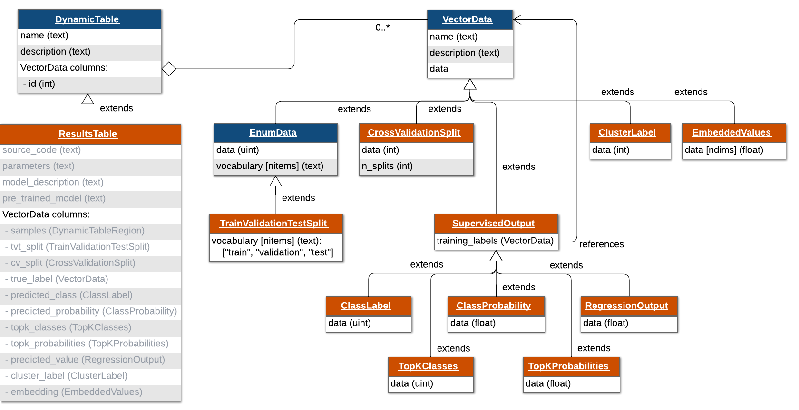

# HDMF-AI - an HDMF schema and API for AI/ML workflows

`HDMF-AI` is a schema and Python API for storing the common results of AI algorithms in a standardized way within the [Hierarchical Data Modeling Framework (HDMF)](https://hdmf.readthedocs.io/en/stable/).

`HDMF-AI` is designed to be flexible and extensible, allowing users to store a range of AI and machine learning results and metadata, such as from classification, regression, and clustering. These results are stored in the `ResultsTable` data type, which extends the `DynamicTable` data type within the base HDMF schema. The `ResultsTable` schema represents each data sample as a row and includes columns for storing model outputs and information about the AI/ML workflow, such as which data were used for training, validation, and testing.

By leveraging existing HDMF tools and standards, `HDMF-AI` provides a scalable and extensible framework for storing AI results in an accessible, standardized way that is compatible with other HDMF-based data formats, such as [Neurodata Without Borders (NWB)](https://nwb-overview.readthedocs.io/), a popular data standard for neurophysiology, and [HDMF-Seq](https://github.com/exabiome/deep-taxon), a format for storing taxonomic and genomic sequence data. By enabling standardized co-storage of data and AI results, `HDMF-AI` may enhance the reproducibility and explainability of AI for science.



## Installation

```bash
pip install hdmf-ai
```

## Usage

For example usage, see `example_usage.ipynb`.
