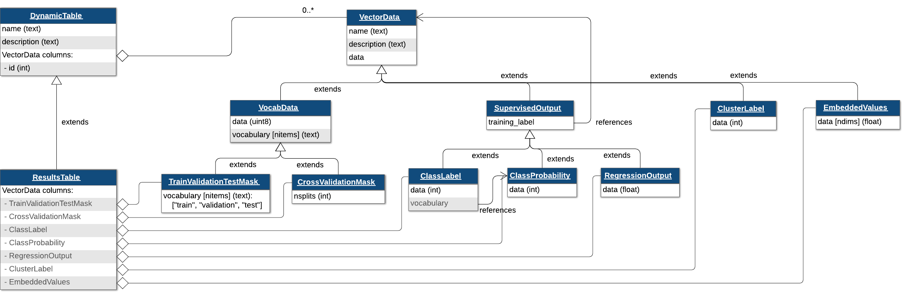

# Summary

Scientists are increasingly using artificial intelligence (AI) methods that learn directly from data to make new discoveries in complex systems across multiple domains. However, the lack of standardized data and models in the scientific community hinders the reproducibility and reusability of these methods and their results [@huerta2023fair] [@goble2020fair]. Here, we present `HDMF-AI`, a schema and API for storing the common results of AI algorithms in a standardized way. `HDMF-AI` is designed to be flexible and extensible, allowing users to store a range of AI results. These results can be directly linked to the model training data, which enables greater understanding of how models solved the task and more comprehensive analysis of errors. `HDMF-AI` provides users with a convenient programming interface for reading and writing AI results, with powerful options to optimize storage space and data transfer. By using `HDMF-AI`, scientists can easily make their results available and share them with others, helping to ensure that their work is reproducible and reusable.

# Statement of Need

Modern AI approaches, such as deep learning, are powerful at uncovering subtle structure in complex datasets that are informative for solving a task. These approaches can also discover structures that may be scientifically artefactual [@belthangady2019applications]. For example, there may be relationships between the data acquisition protocols and the collected data, and deep learning could potentially utilize such "nuisance variables" when solving the task. Thus, to trust the results of AI algorithms, we must understand what data features/samples a trained model is utilizing to solve the task, and link that to metadata about those samples to interpret and evaluate the basis of results. Many solutions exist for provenance tracking of AI/ML workflows, e.g., [@souza2019provenance]; however, these solutions are designed for production settings and are difficult to use in exploratory analysis. Although many scientific communities have standardized formats for sharing self-describing data, the AI community has no standard format that connects data and models. The adoption of AI by scientists hinges on making data, models, and workflows FAIR (Findable, Accessible, Interoperable, Reusable) [@wilkinson2016fair] and cross-referenceable to each other to maximize interpretability, reproducibility, and reusability.

`HDMF-AI` is a schema and Python API for storing the common results of AI algorithms in a standardized way within the Hierarchical Data Modeling Framework (HDMF) [@tritt2019hdmf]. `HDMF-AI` is designed to be flexible and extensible, allowing users to store a range of AI and machine learning results and metadata, such as from classification, regression, and clustering. These results are stored in the `ResultsTable` data type, which extends the `DynamicTable` data type within the base HDMF schema. The `DynamicTable` schema supports simple tabular data as well as more complex structures common in scientific data, such as ragged arrays, n-dimensional arrays, and enumerations. The `ResultsTable` schema represents each data sample as a row and includes columns for storing model outputs and information about the AI/ML workflow, such as which data were used for training, validation, and testing. These columns are represented as new data types in the schema to allow extension and composition in other data types (see \autoref{fig:schema}). By extending `DynamicTable`, the `ResultsTable` allows the user to add arbitrary columns, enabling the storage of non-standardized metadata and AI outputs, such as performance metrics, alongside the standardized columns. The `ResultsTable` schema also supports a direct link to data stored in another `DynamicTable`, enabling the user to associate AI results with the original data. This link allows for greater understanding of how models are completing the task and analysis of any associated errors. The schema also supports the storage of model parameters and links to the source code(s) used to train the model, as well as links to publicly available pre-trained models if they were used.

Using the HDMF API, the `ResultsTable` can easily be added to datasets that follow an HDMF-based standard, such as Neurodata Without Borders [@rubel2022neurodata], a popular data standard for neurophysiology, and HDMF-Seq, a format for storing taxonomic and genomic sequence data [@Tritt_deep-taxon]. HDMF provides core functionality that allows `HDMF-AI` users to store AI results using advanced features and options for efficient storage and access, such as chunking, compression, and selective streaming from an S3 bucket. Users can write results to an HDF5 file, a popular file format for scientific data and high-performance computing [@hdf5], or a Zarr store, a new format optimized for cloud computing [@zarr]. By leveraging existing HDMF tools and standards, `HDMF-AI` provides a scalable and extensible framework for storing AI results in an accessible, standardized way that is compatible with other HDMF-based data formats. By enabling standardized co-storage of data and AI results, `HDMF-AI` may enhance the reproducibility and explainability of AI for science.

# Acknowledgements

This work is part of the ENDURABLE project supported by the Advanced Scientific Computing Research (ASCR) program in the U.S. Department of Energy, Office of Science, Office of Biological and Environmental Research (BER) [DE-AC02-05CH11231 to LBNL].

# References
